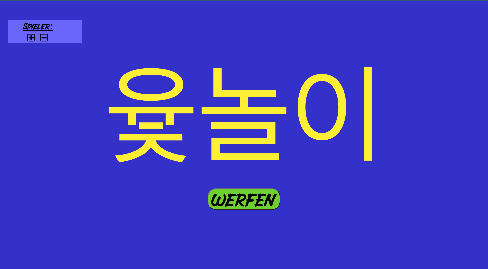
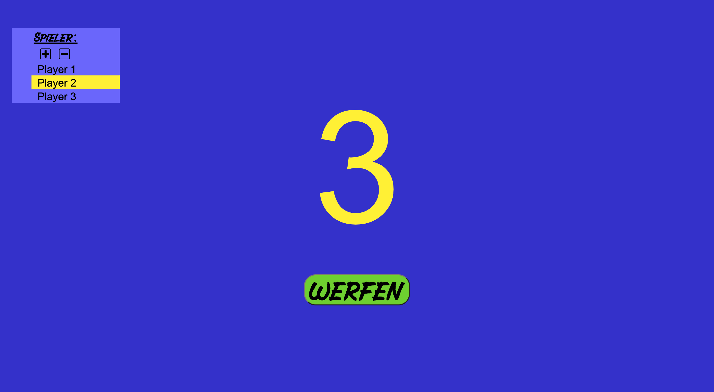
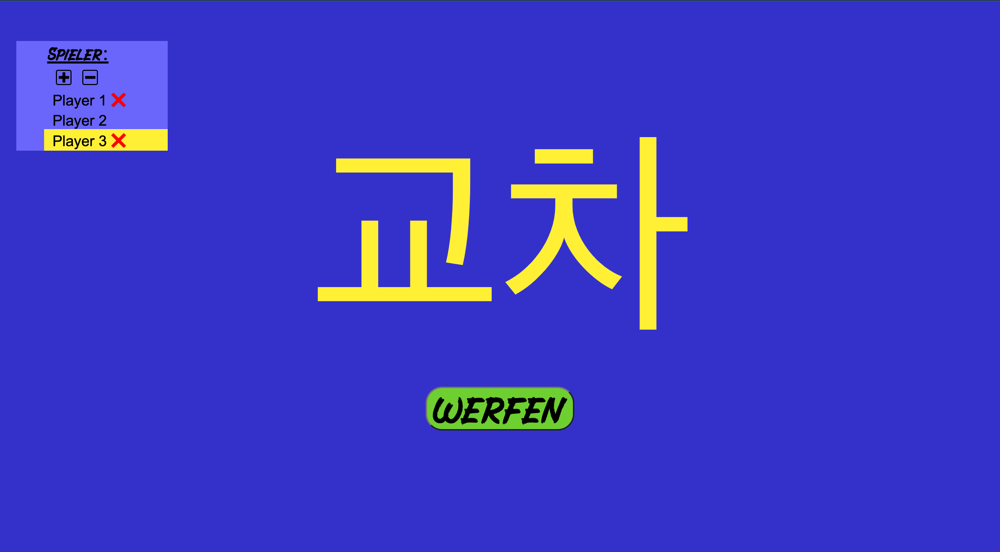

# Yutnori sticks simulator

A simple web-app to generate random Yut-stick results used in Yut-Nori, a traditional Korean game.

Currently it is in german, but I want to add an option to change the language between english and german in the future.

If players are specified, it keeps track of who is currently on the turn. At each throw, the next player gets highlighted.
Except, when the value is a 4 or a 5 or "교차" (crossed), then the same player gets to throw again. It also keeps track of the number of warnings ("교차") a player received. If this number reaches 3, the player gets removed from the list.

If you mis clicked, you can revert the changes with the arrow keys: up and down changes the active player, while left and right de- and increases the number of warnings a player received.
You can also directly click a player to change who is next.

This is basically my first self designed HTML/CSS/Javascript application. It was a bit fiddly, because I had to google a lot, but in the end it works.

I didn't account for different browsers, so if it doesn't work properly in your browser, please let me know.

### Screenshots

### Resources
- The plus and minus icons were made by https://www.flaticon.com/authors/dave-gandy.
- The g-guelo font was made by https://www.fontspace.com/wepfont.
- The lanecar font was made by https://www.fontspace.com/viaction-type.
- All the sounds wer custom made.